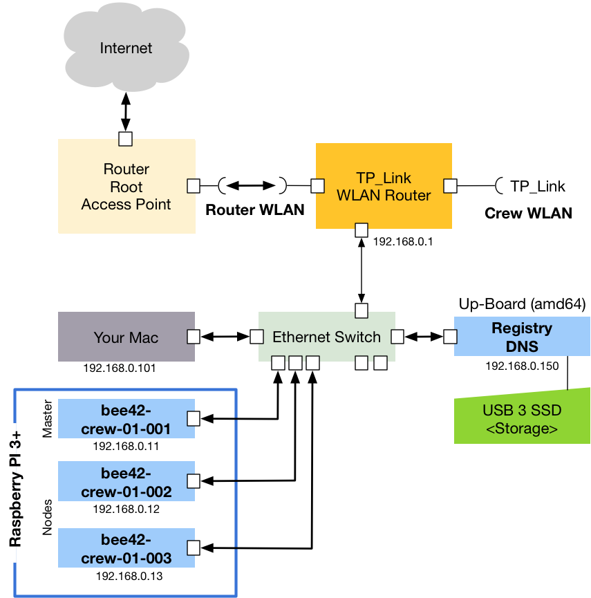
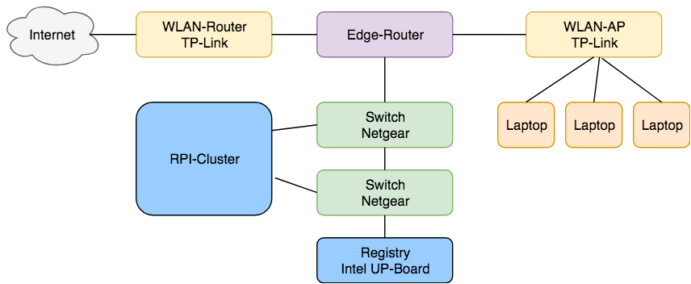

# Kubernetes-On-Embedded

Dies ist das Repo für unseren Blogpost https://bee42.com/de/blog/Kubernetes_Cluster_Embedded/, schaut mal rein!

## Kubernetes 1.9 mit Docker 17.03

_Achtung: Mit der Hypriot-Version 1.4.0 gab es einen schwerwiegenden Fehler: Die Machine-ID wurde nicht neu generiert und war deshalb bei allen RPI's identisch. Das führte zu [Problemen](https://stackoverflow.com/questions/49113253/kubernetes-pods-stuck-at-containercreating) mit dem Netzwerk-Layer!_



Alternative kann man den Cluster auch folgendermassen aufbauen:

Wir bauen einen kompleten Kubernetes-Cluster auf Embedded-Hardware. Dazu benutzen wir einen EdgeRouterX, 2 WLAN-Router, 2 Switches, ein Intel UP-Board und für den eigentlichen K8S-Cluster Raspberry Pi's.



## Einkaufswagen füllen, bestellen, bezahlen, installieren und Spaß haben!

Alle Komponenten die Ihr braucht um einen Docker PI-Cluster aufzubauen können in der Regel preiswert und zuverlässig bestellt werden. Wir haben uns an der Liste von [Roland Huss](https://ro14nd.de/kubernetes-on-raspberry-pi3) orientiert:

Danke Roland :-)

Wir haben hier den aktuellsten RPI Modell 3B+ genommen, ein RPI 2 funktioniert aber auch, natürlich mit Abstrichen in der Leistung.

Stand 2018-10 ca. 290 Euro

| Anzahl | Systemkomponente                                              | Preis      |
|:-------|:--------------------------------------------------------------|:-----------|
| 3      | [Raspberry Pi 3 B+](https://www.amazon.de/dp/B07BDR5PDW)      | 3 * 41 EUR |
| 3      | [Micro SD Card 32 GB](https://www.amazon.de//dp/B073JWXGNT)   | 3 *  8 EUR |
| 1      | [WLAN Router](https://www.amazon.de/dp/B01MY5JIJ0)            | 1 * 34 EUR |
| 4      | [USB Kabel](https://www.amazon.de/dp/B016BEVNK4)              | 1 *  7 EUR |
| 1      | [USB Stromgerät](https://www.amazon.de/dp/B00PTLSH9G)         | 1 * 29 EUR |
| 1      | [Gehäuse](https://www.amazon.de/dp/B00NB1WPEE)                | 1 * 10 EUR |
| 2      | [Zwischenplatten](https://www.amazon.de/dp/B00NB1WQZW)        | 2 *  7 EUR |
| 5      | [Ethernet Kabel](https://www.amazon.de/dp/B005VFZ00E)         | 1 *  8 EUR |
| 1      | [Ethernet 8 Port Switch](https://www.amazon.de/dp/B000092RRM) | 1 * 32 EUR |

### Optionen

* Kühler für die PI kaufen und installieren
* OnOff Shim von Pimoroni installieren oder selber bauen
  * https://shop.pimoroni.com/products/onoff-shim
  * http://www.netzmafia.de/skripten/hardware/RasPi/Projekt-OnOff/index.html
* Nicht vergessen es wird ein Ethernet Switch und Ethernetkabel benötigt. Die WLAN Verbindungen sind in der Regel zu störanfällig.
  * https://www.amazon.de/dp/B01MU3WUX1
  * https://www.amazon.de/dp/B01N362YPG
* POE Switch und POE 3+ Hat installieren.
  * https://shop.pimoroni.com/products/raspberry-pi-poe-hat
* TP-Link-TL-WR902AC-AC750
  * https://www.amazon.de/dp/B01MY5JIJ0
  * Konfiguration via ROOT WLAN Access Point spart den Edge Router und die zweiten TP Link Access Point.
  
## Kubernetes 1.12.x mit Docker 18.06.x

Stand: 2018-10-06

Wer die aktuelle Docker 18.06 mit dem aktuellen Kubernetes 1.12.x zum laufen bringen möchte,
muss etwas in die Trickkisten greifen und das OS Image für die RPIs selber herstellen.

### Selbsterstellen des Hypriot OS mit aktuallisierten Packages

* https://github.com/hypriot/image-builder-rpi

Installieren von virtualbox und vagrant mit Homebrew

* https://brew.sh/
* http://caskroom.io/

```
$ brew cask install virtualbox
$ brew cask install virtualbox-extension-pack
$ brew cask install vagrant
```

```
$ git clone https://github.com/hypriot/image-builder-rpi
$ cd image-builder-rpi
$ vagrant up
$ export DOCKER_HOST=tcp://127.0.0.1:2375
# check OS version and docker version
$ docker info | grep 'Operating System'
Operating System: Ubuntu 16.04.5 LTS
$ mv versions.config versions-orginal.config
$ cat >versions.config <<EOF
# config vars for the root file system
HYPRIOT_OS_VERSION="v2.0.1"
ROOTFS_TAR_CHECKSUM="d1e7e6d48a25b4a206c5df99ecb8815388ec6945e4f97e78413d5a80778d4137"

# name of the ready made raw image for RPi
RAW_IMAGE="rpi-raw.img"
RAW_IMAGE_VERSION="v0.2.2"
RAW_IMAGE_CHECKSUM="2fbeb13b7b0f2308dbd0d82780b54c33003ad43d145ff08498b25fb8bbe1c2c6"

# specific versions of kernel/firmware and docker tools
export KERNEL_BUILD="20180422-141901"
# For testing a new kernel, use the CircleCI artifacts URL.
# export KERNEL_URL=https://62-32913687-gh.circle-artifacts.com/0/home/circleci/project/output/20180320-092128/raspberrypi-kernel_20180320-092128_armhf.deb
export KERNEL_VERSION="4.14.34"
export DOCKER_CE_VERSION="18.06.1~ce~3-0~raspbian"
export DOCKER_COMPOSE_VERSION="1.22.0"
export DOCKER_MACHINE_VERSION="0.15.0"
EOF
$ make sd-image
$ make test
flash hypriotos-rpi-dirty.img.zip
# put SD card to rpi and switch it on
$ ssh prirate@black-pearl.local
$ docker version
$ sudo apt-get update
$ sudo apt-get install rpi-update
$ sudo rpi-update
$ sudo reboot
```

### RPI Hypriot OS Kernel Build

* https://github.com/hypriot/rpi-kernel

Prüfen die vorhandenen Kernels im [Hypriot Deb Repo](https://packagecloud.io/Hypriot/rpi/debian)

```
$ ssh -i ~/.ssh/id_ed25519-rpi pirate@192.168.0.41
$ sudo apt-cache madison raspberrypi-kernel
```

__Tipp__: Wenn der Kernel selbst gebaut werden muss, prüfe ob das "privileged: true" Flag im `Vagrantfile`gesetzt ist.

* Starte einen lokalen HTTP Server für das _image-builder-rpi_ Projekt.
* Prüfe die Informationen im `build_results` Verzeichnis und addiere den Pfad in der Datei `versions.config` im der `KERNEL_URL` Variable.

```
$ cat >docker-compose.yml <<EOF
version: '3'
services:
  nginx: 
    image: nginx:latest
    volumes:
      - ./nginx-cache:/var/cache/nginx
      - ./nginx-pid:/var/run
      - ./build_results:/usr/share/nginx/html:ro
    ports:
      - 8081:80
    read_only: true
EOF
$ docker-compose up -d
```

Hier zur Ansicht meine `versions.config``

```
$ cat >versions.config <<EOF
# config vars for the root file system
HYPRIOT_OS_VERSION="v2.0.1"
ROOTFS_TAR_CHECKSUM="d1e7e6d48a25b4a206c5df99ecb8815388ec6945e4f97e78413d5a80778d4137"

# name of the ready made raw image for RPi
RAW_IMAGE="rpi-raw.img"
RAW_IMAGE_VERSION="v0.2.2"
RAW_IMAGE_CHECKSUM="2fbeb13b7b0f2308dbd0d82780b54c33003ad43d145ff08498b25fb8bbe1c2c6"

# specific versions of kernel/firmware and docker tools
# export KERNEL_BUILD="20180422-141901"
export KERNEL_BUILD="20181007-162516"
# For testing a new kernel, use the CircleCI artifacts URL.
# export KERNEL_URL=https://62-32913687-gh.circle-artifacts.com/0/home/circleci/project/output/20180320-092128/raspberrypi-kernel_20180320-092128_armhf.deb
export KERNEL_URL=http://192.168.178.56:8081/20181007-162516/raspberrypi-kernel_20181007-162516_armhf.deb
export KERNEL_VERSION="4.14.70"
export DOCKER_CE_VERSION="18.06.1~ce~3-0~raspbian"
export DOCKER_COMPOSE_VERSION="1.22.0"
export DOCKER_MACHINE_VERSION="0.15.0"
EOF
```

Wenn die Disk zu klein ist kann das _vagrant-disksize_ Plugin vielleicht helfen:

* https://github.com/sprotheroe/vagrant-disksize

```
Vagrant.configure("2") do |config|

    required_plugins = %w( vagrant-vbguest vagrant-disksize )
    _retry = false
    required_plugins.each do |plugin|
        unless Vagrant.has_plugin? plugin
            system "vagrant plugin install #{plugin}"
            _retry=true
        end
    end

    if (_retry)
        exec "vagrant " + ARGV.join(' ')
    end

    config.vm.box = "ubuntu/trusty64"
    config.disksize.size = "30GB"
end
```

## SD-Karten für den beehive PI-Cluster vorbereiten

Es gibt mehrere Möglichkeiten ein RPi-Image auf eine SD-Karte zu bekommen. Wir nutzen für diesen Anwendungsfall das [Flash Tool der Hypriot Priraten](https://github.com/hypriot/flash). Als Basis der Installation verwenden wir das aktuelle [Hypriot OS](https://github.com/hypriot/image-builder-rpi/).

### Installation des Werkzeuges Flash unter Linux / OS X

Mit folgendem Befehlen installiert Ihr das Hypriot Flash Tool:

```
$ curl -O https://raw.githubusercontent.com/hypriot/flash/master/flash
$ chmod +x flash
$ sudo mv flash /usr/local/bin/flash
```

### Download des Hypriot OS-Images

Da Kubernetes in der Version 1.9.x offziel nur Docker CE bis 17.03 unterstützt, nehmen wir das Image V1.7.1 und (re-)installieren im weiteren Verlauf darauf Docker in der passenden Version:

```bash
$ mkdir OS-Images
$ cd OS-Images
$ HOS_VERSION=1.7.1
$ HOS_URL=https://github.com/hypriot/image-builder-rpi/releases/download
$ curl -LO ${HOS_URL}/v${HOS_VERSION}/hypriotos-rpi-v${HOS_VERSION}.img.zip
```

Entpacken des Images:

```bash
$ unzip hypriotos-rpi-v${HOS_VERSION}.img.zip
```

Alternative kann das selbsterstellte hypriotos images mit docker 18.06.x für Kubernetes 1.12.1 verwendet werden. Dort muss aktuell nur der Kernel immer manuelle auf den aktuellen Stand 4.14.73 oder neuer gebracht werden.

### Erstellen der Konfiguration `user-data.yml`

In dieser Datei können diverse Einstellungen vorgenommen werden, z.B. der zu vergebende Hostname, anzulegende User, oder, wie im folgenden Beispiel, SSH-Public-Keys für den passwortlosen Zugriff. Ein Beispiel findet Ihr im Repo.

### Flashen des OS-Images

Nach Erstellung der Datei `user-data.yml` könnt Ihr diese direkt mit auf die SD-Karte flashen. Ansonsten könnt ihr auch nach dem flashen die `user-data.yml` direkt auf dem PI bearbeiten.

```bash
$ flash -n "bee42-crew-01-001" -u "user-data.yml" hypriotos-rpi-v${HOS_VERSION}.img
```

## Raspberry-Pi starten

Nach dem Einsetzen der Karten könnt Ihr den Raspberry-PI starten. Nun könnt Ihr Euch zum Test mit dem PI per SSH verbinden.

```bash
$ ssh pirate@<ip>
```
__Frage__: Wie bekommt eigentlich heraus welche IP dem PI vom DHCP Server zugeordnet wurde?

```
# install nmap
$ brew install nmap
$ nmap -sn 192.168.0.0/24 # Durch Euer Netz ersetzen
```

Das Passwort für den Nutzer __pirate__ lautet: **hypriot**.

Im Blog der Hypriot Piraten findet Ihr jede Mengen Erklärungen zum Thema Docker on ARM:

* https://blog.hypriot.com/getting-started-with-docker-on-your-arm-device/
* https://hub.docker.com/u/hypriot/

## Kubernetes-Cluster installieren

### Installation des Kubernetes-Masters

Zur Ausführung unseres Installationsscripts auf den einzelen RPIs benutzen wir [Ansible](https://docs.ansible.com/ansible/latest/installation_guide/intro_installation.html).

```
$ brew install ansible
```

Dafür benötigen wir zunächst ein Inhaltsverzeichnis. Wir haben mehrere Cluster, deshalb ist die Konfiguration in der Datei `cluster` etwas größer angelegt:

```
[cluster-1-master]
192.168.0.11

[cluster-1-nodes]
192.168.0.12
192.168.0.13

[cluster-1:children]
cluster-1-master
cluster-1-nodes

[cluster-1:vars]
fqdn_master="bee42-crew-01-001.local"
network_address_master="192.168.0.11"

[master:children]
cluster-1-master

[nodes:children]
cluster-1-nodes

```

Ansible verbindet sich per SSH auf die zu verwaltenden Rechner, dort muss also öffentlicher SSH-Key hinterlegt sein. Falls Ihr noch keinen habt, hier ein kleines Beispiel:

```bash
# Schlüssel erzeugen
$ ssh-keygen -t ed25519 -C "name@example.org"

# Öffentlichen Schlüssel auf alle RPIs kopieren
$ ssh-copy-id pirate@192.168.0.11
$ ssh-copy-id pirate@192.168.0.12
...

# Testen der Maschinenverfügbarkeit :
$ export SSH_KEY=~/.ssh/id_ed25519
$ ansible -u pirate --key=$SSH_KEY -i cluster -m ping all
192.168.0.11 | success >> {
    "changed": false, 
    "ping": "pong"
}

192.168.0.12 | success >> {
    "changed": false, 
    "ping": "pong"
}
```

### K8s-Cluster erzeugen

So, wenn alle Vorbereitungen abgeschlossen sind, kann der Kubernetes-Cluster erzeugt werden. Ein RPI wird zum Master und die restlichen werden als Nodes angeschlossen.

```bash
$ export K8sCLUSTER=cluster-1
$ ansible-playbook -u pirate --key=$SSH_KEY -i cluster -l $K8sCLUSTER kubernetes.yml
```

__Todo__:

* Kopieren der Images eines Release in eine Registry
* Installation der PI's auf der Basis dieser Registry
* Einrichten eines Mirrors
* Einrichten eines DNS Server für alle Cluster
* Test mit einem Unify Router via Ethernet
  * WLAN Router nur für Crew
  * Test mit weiteren AccessPoints
  * DHCP?
* Loadbalancer
  * Metall LB
* External DNS
  * Noip Dynamic DNS

### Cluster vernichten

Manchmal möchte man den Cluster abreissen und vielleicht in einer anderen Version neu bauen, deshalb gibt es auch ein Reset-Playbook:

```bash
$ ansible-playbook -u pirate --key=$SSH_KEY -i cluster -l $K8sCLUSTER reset.yml
```

__TIPP__: Phönix aus der Asche entstehen lassen

Wer einen wirklich unbelastete Maschine benötigt, sollte allerdings lieber die SD Karte flashen und den RPI neu starten.

Liebe Grüße</br>
Peter <peter.rossbach@bee42.com>
